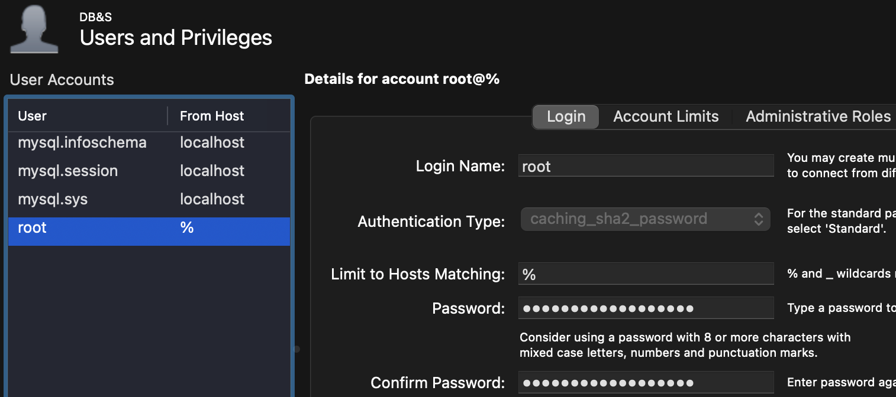

# HS25 DB&S

## Credentials

- Metabase: `mail@mail.mail:security101`
- MySQL: `root:security101`

## Data

### Road Accidents

Our first datasource are official collected data about road accidents with people getting hurt by the Federal Roads Office: <https://data.geo.admin.ch/ch.astra.unfaelle-personenschaeden_alle/>

To download it you have to first download a ZIP with the metadata. In which we find a README with the actual links to the datasets.
We are using the JSON with the `WGS84` coordinates. This is the global coordinate system. The other files use the Switzerland specific coordinate system `LV95`. As this is not widly supported and the conversion to `WGS48` is a [hassle](https://de.wikipedia.org/wiki/Schweizer_Landeskoordinaten#Berechnungsgrundlagen), we chose the global one.

#### Transform

To transform the data to data usable by MySQL we create a script with the use of Grok AI to convert the data we need to CSV files. See the [road-accidents/README.md](./road-accidents/README.md) for more info of the data.

The script is [convert.py](./road-accidents/convert.py).

The files created are:

- [accidents.csv](./road-accidents/accidents.csv)
- [accident_types.csv](./road-accidents/accident_types.csv)
- [road_types.csv](./road-accidents/road_types.csv)
- [severity_categories.csv](./road-accidents/severity_categories.csv)

#### Import

To import the data we have created a [import.sql](./road-accidents/import.sql) which:

1. Set the database with `USE weathercrash;`
2. Create the tables with `CREATE TABLE IF NOT EXIST ...`
3. Enable local file loading
4. Load CSV files into DB with `LOAD LOCAL FILE ...`
5. Disable local file loading

Use this command to execute the file:

```sh
mysqlsh --sql -u root -h localhost -f ./road-accidents/import.sql
```

### Population Numbers

In order to be able to see the accidents per canton in comparison with each other we need to know the population per canton during the timeframe of the comparison. This data is provided to use by the Federal Statistics Office: [Demographic balance by canton](https://www.bfs.admin.ch/bfs/en/home/statistics/catalogues-databases.assetdetail.36074763.html)

The data we use is purely 2011-2024 (as the road accident dataset), all cantons, population of all genders and all citizenships by first and last day of the year.
An interactive view is available online [here](https://www.pxweb.bfs.admin.ch/pxweb/en/px-x-0102020000_101/px-x-0102020000_101/px-x-0102020000_101.px/) with our view [here](https://www.pxweb.bfs.admin.ch/sq/b92d1d67-c5f4-48b2-a89f-534db17c2881).

Data description found at [population/README.md](./population/README.md)

#### Transform

The data was then exported as CSV transformed to remove unused data (category col, sex col, and "No Indication" rows which were emtpy anyway).

⚠️ The downloaded CSV is encoded as `ISO-8859-1` not `UTF-8`. The transformed CSV is `UTF-8` encoded.

This is done using the [convert.py](./population/convert.py) script.

Both the orignal and the transformed CSV are found here:

- Original: [px-x-0102020000_101_20251021-165023.csv](./population/px-x-0102020000_101_20251021-165023.csv)
- Transformed: [Population.csv](./population/Population.csv)

#### Import

To import it use:

```sh
mysqlsh --sql -u root -h localhost -f ./population/import.sql
```

## MySQL

### Installation

Server was installed via the installation file from the official website. During the installation you have to select the server and the client. While configuring the server, after the installation, make sure you have the creation of a Windows Service enabled.

We chose the password `security101`.

### Configuration

To be able to import large files such as our traffic database you have to change two settings on the MySQL server.

- `max_packet_allowed` - Maximum size of a packet a client can send to the server.
- `mysqlx_max_allowed_packet` - X Plugin equivalent of `max_allowed_packet`. Used for the json import util.

Change these in the default configuration file at: `sudo nvim 'C:\ProgramData\MySQL\MySQL Server 8.0\my.ini'`

```ini
# The maximum size of one packet or any generated or intermediate string, or any parameter sent by the
# mysql_stmt_send_long_data() C API function.
max_allowed_packet=1G
mysqlx_max_allowed_packet=1G
```

For remote connection to the database, we replaced the "localhost" within the access limit to % meaning from everywhere.



#### Performance Optimizations

```diff
diff --git "a/C:\\ProgramData\\MySQL\\MySQL Server 8.0\\my.ini.bak" "b/C:\\ProgramData\\MySQL\\MySQL Server 8.0\\my.ini"
index f87f2c2..e2db43a 100644
--- "a/C:\\ProgramData\\MySQL\\MySQL Server 8.0\\my.ini.bak"
+++ "b/C:\\ProgramData\\MySQL\\MySQL Server 8.0\\my.ini"
@@ -184,7 +184,7 @@ temptable_max_ram=1G
 # by the MEMORY storage engine and, as of MySQL 8.0.28, the TempTable storage
 # engine. If an internal in-memory temporary table exceeds this size, it is
 # automatically converted to an on-disk internal temporary table.
-tmp_table_size=23M
+tmp_table_size=1G

 # The storage engine for in-memory internal temporary tables (see Section 8.4.4, "Internal
 # Temporary Table Use in MySQL"). Permitted values are TempTable (the default) and MEMORY.
@@ -254,7 +254,7 @@ innodb_log_buffer_size=16M
 # stated maximum. When the size of the buffer pool is greater than 1GB, setting
 # innodb_buffer_pool_instances to a value greater than 1 can improve the scalability on
 # a busy server.
-innodb_buffer_pool_size=128M
+innodb_buffer_pool_size=2G

 # Defines the amount of disk space occupied by redo log files. This variable supersedes the
 # innodb_log_files_in_group and innodb_log_file_size variables.```

### Setup

First we have to create a new database called `weathercrash`. Afterwards we import the data (which is in CSV, converted from JSON) into the database.

```sh
# Create the "weathercrash" database
mysqlsh --sql -u root -p -h localhost --execute "CREATE DATABASE weathercrash";   # Let it save the password so you don't have to enter it every time

# Import the json into the database
mysqlsh -u root -h localhost --execute "util.importJson('RoadTrafficAccidentLocations.json', {schema: 'weathercrash', table: 'accidents', tableColumn: 'features'})"
```

You should see a success message like this:

```plain
Importing from file "RoadTrafficAccidentLocations.json" to table `weathercrash`.`accidents` in MySQL Server at localhost:33060

.. 1
Processed 420.86 MB in 1 document in 52.9161 sec (0.02 document/s)
Total successfully imported documents 1 (0.02 document/s)
```

## Metabase Credentials

We installed metabase via `scoop`:

```sh
scoop bucket add java
scoop install openjdk metabase
# Installing...

metabase  # Start the metabase server
```

The port used is 3000
On the Windows VM we added an exception for java.exe to allow remote connectivity to metabase.

Setup a new user. In our case:

- First name: `Mai`
- Lastname: `Esquel`
- Mail: `mail@mail.mail`
- Password: `security101`

### Connect to DB

In order to connect to the database you have to allow `jdbc` to fetch the RSA public key from the server.

Expand the additional setting in the bottom and add this to the `jdbc` connection options: `allowPublicKeyRetrieval=true`
